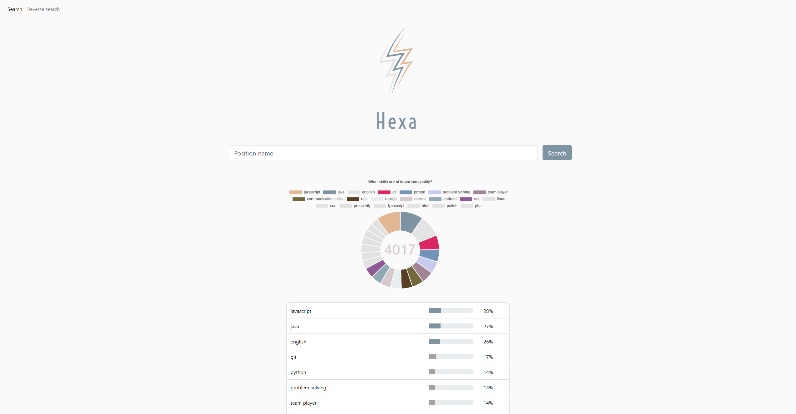
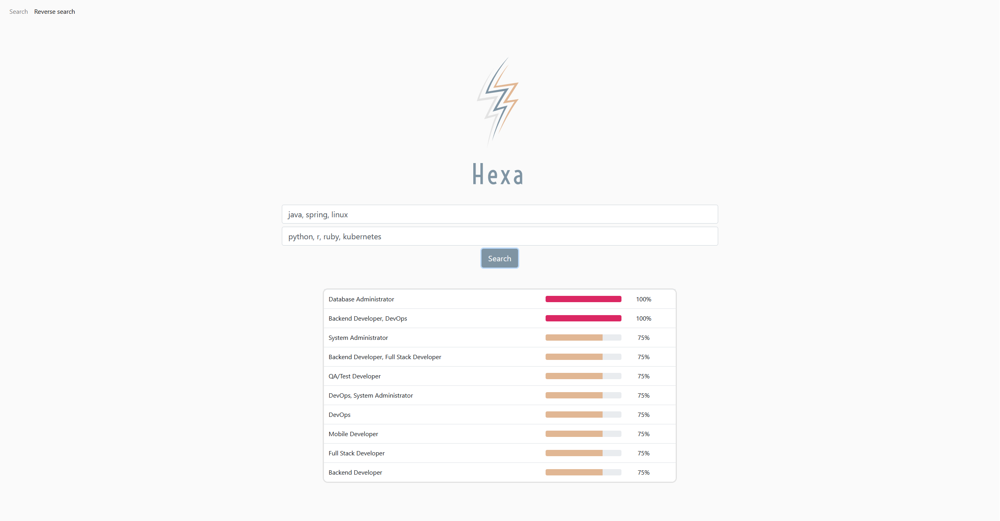

# BiteHack2020
Repository with "Hexa" - our solution prepared for programming task at BiteHack 2020.
Our solution won Sabre competition by allowing recruiters observer job market from another perspective. Hexa is an answer to growing
demand for new workers. This tool simplifies and clarifies recrutation process for both recruiter and person being recruited.
Main features:
 - Search engine:
    Search engine allows user to find out what skills are mainly required for some specific job type (for example: "Senior Java Developer")
 - Reverse search engine:
    Reverse search engine can tell what should be called position which requires provided skills (Python + Django -> "Backend Developer")
 - Skills summarization:
    Hexa can show what skills are most common together with others skills, for example (javascript -> html, css, typescript...)

This repository contains two main files, index.html and reverseSearch.html - these html files are frontend of Hexa Search Engine.

Frontend is responsible for sending requests to our backend server which is written in Python Flask. 

Backend code is located under server/ directory. It consists of *server.py* file - this one should be executed to run our service
 - reverse_search.py - file with class able to build reverse search dictionaries and to perform reverse search
 - aggregate.py - file with class able to build search df and find skill sumarization.
 
There is also nofluffjobs scrapper in noFluffJobs/ directory. It uses selenium with chromedriver, because noFluffJobs uses mainly js.

The tool is available online as http://bit.ly/hexa-search-persistent

## Screenshots
Main search:

Reverse search:

